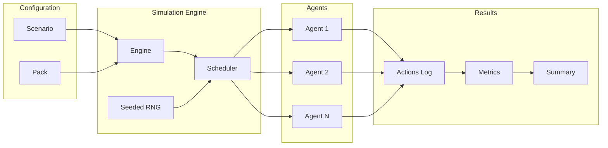

<p align="center">
  <picture>
    <source media="(prefers-color-scheme: dark)" srcset="logo-dark.svg">
    <source media="(prefers-color-scheme: light)" srcset="logo-light.svg">
    
  </picture>
</p>

<p align="center">
  <strong>Stress-test your protocol's economic assumptions before mainnet.</strong>
</p>

<p align="center">
  <a href="https://www.npmjs.com/package/agentforge"></a>
  <a href="https://github.com/wkyleg/agentforge/actions/workflows/ci.yml"></a>
  <a href="https://opensource.org/licenses/MIT"></a>
  <a href="https://www.typescriptlang.org/"></a>
  <a href="https://nodejs.org/"></a>
</p>

<p align="center">
  <a href="#installation">Installation</a> •
  <a href="#quick-start">Quick Start</a> •
  <a href="#core-concepts">Concepts</a> •
  <a href="#writing-scenarios">Scenarios</a> •
  <a href="#writing-agents">Agents</a> •
  <a href="#cli-reference">CLI</a> •
  <a href="#examples">Examples</a>
</p>

---

## What is AgentForge?

AgentForge is a **type-safe agent-based simulation framework** for Foundry/EVM protocols. Define autonomous agents, run them against your smart contracts, and validate economic invariants—all with deterministic, reproducible results.

### Why Agent-Based Modeling?

Traditional testing validates individual functions. Agent-based modeling validates **emergent system behavior**:

- How do 1000 users interacting create MEV opportunities?
- Does your AMM stay solvent under extreme volatility?
- What happens when rational actors exploit edge cases?

### Features

<table>
<tr>
<td width="50%">

**Deterministic Simulation**
- Same seed = identical results
- Reproducible debugging
- CI regression testing

</td>
<td width="50%">

**Type-Safe TypeScript**
- Full type inference
- Compile-time validation
- IntelliSense support

</td>
</tr>
<tr>
<td width="50%">

**Foundry Integration**
- Direct Anvil connection
- ABI type generation
- Fork mainnet state

</td>
<td width="50%">

**Flexible Scheduling**
- Round-robin, random, priority
- Custom tick durations
- Parallel agent execution

</td>
</tr>
<tr>
<td width="50%">

**Rich Agent Primitives**
- Memory persistence
- Cooldown management
- Parameterized behavior

</td>
<td width="50%">

**Built-in Analytics**
- Time-series metrics
- CSV/JSON export
- Assertion validation

</td>
</tr>
</table>

---

## Architecture



**Key Components:**

| Component | Description |
|-----------|-------------|
| **Scenario** | Defines simulation parameters: seed, duration, agents, assertions |
| **Pack** | Protocol adapter providing blockchain state and contract interactions |
| **Engine** | Orchestrates simulation lifecycle and tick execution |
| **Scheduler** | Determines agent execution order per tick |
| **Agent** | Autonomous actor that decides actions based on state |
| **Metrics** | Collects and aggregates simulation data |

---

## Installation

```bash
# Using pnpm (recommended)
pnpm add agentforge

# Using npm
npm install agentforge

# Using yarn
yarn add agentforge
```

**Requirements:**
- Node.js 18.0.0 or higher
- For EVM simulations: [Foundry](https://book.getfoundry.sh/getting-started/installation) with Anvil

---

## Quick Start

### 1. Initialize Project Structure

```bash
npx agentforge init
```

This creates:
```
sim/
├── scenarios/      # Your simulation definitions
├── agents/         # Custom agent implementations
├── packs/          # Protocol adapters
└── results/        # Simulation output (gitignored)
```

### 2. Verify Setup

```bash
# Run built-in toy scenario
npx agentforge run --toy

# Check environment dependencies
npx agentforge doctor
```

### 3. Run Your First Simulation

```bash
npx agentforge run sim/scenarios/my-scenario.ts
```

---

## Core Concepts

### Scenarios

A scenario is the entry point for any simulation. It defines:

- **Seed** — Ensures deterministic randomness
- **Ticks** — Number of simulation steps
- **Pack** — Protocol adapter for blockchain interaction
- **Agents** — Autonomous actors and their configurations
- **Assertions** — Invariants to validate after simulation

### Packs

Packs are protocol adapters that provide:

- Initial blockchain state setup
- Contract deployment and interaction helpers
- State reading utilities for agents
- Custom action execution logic

### Agents

Agents are autonomous actors that:

- Receive context about current simulation state
- Decide what action to take (or skip)
- Maintain memory across ticks
- Use deterministic RNG for decisions

### Determinism

**Same seed + same scenario = identical results.**

- Agent execution order shuffled deterministically per tick
- All randomness derives from seeded RNG
- Enables reproducible debugging and CI regression tests

---

## Writing Scenarios

```typescript
import { defineScenario } from 'agentforge';
import { ToyPack, RandomTraderAgent, MomentumAgent } from 'agentforge/toy';

export default defineScenario({
  name: 'market-stress',
  description: 'Stress test market under high volatility',
  seed: 42,
  ticks: 100,
  tickSeconds: 3600, // 1 hour per tick

  pack: new ToyPack({
    assets: [
      { name: 'TOKEN', initialPrice: 100, volatility: 0.05 },
    ],
    initialCash: 10000,
  }),

  agents: [
    { type: RandomTraderAgent, count: 10 },
    { type: MomentumAgent, count: 5, params: { threshold: 0.02 } },
  ],

  // Optional: Validate simulation outcomes
  assertions: [
    { type: 'gt', metric: 'totalVolume', value: 0 },
    { type: 'gte', metric: 'successRate', value: 0.9 },
  ],
});
```

### Scenario Options

| Option | Type | Description |
|--------|------|-------------|
| `name` | `string` | Unique scenario identifier |
| `description` | `string` | Human-readable description |
| `seed` | `number` | Random seed for determinism |
| `ticks` | `number` | Number of simulation steps |
| `tickSeconds` | `number` | Simulated time per tick |
| `pack` | `Pack` | Protocol adapter instance |
| `agents` | `AgentConfig[]` | Agent types and counts |
| `assertions` | `Assertion[]` | Post-simulation validations |
| `scheduler` | `SchedulerType` | Execution order strategy |

---

## Writing Agents

Extend `BaseAgent` and implement the `step()` method:

```typescript
import { BaseAgent, type Action, type TickContext } from 'agentforge';

export class MyAgent extends BaseAgent {
  async step(ctx: TickContext): Promise<Action | null> {
    // Access deterministic RNG
    if (ctx.rng.chance(0.3)) {
      return {
        id: this.generateActionId('buy', ctx.tick),
        name: 'buy',
        params: { 
          amount: ctx.rng.nextU32() % 100,
          asset: 'TOKEN',
        },
      };
    }
    return null; // Skip this tick
  }
}
```

### Agent Capabilities

#### Memory

Persist state across ticks:

```typescript
// Store a value
this.remember('lastPrice', currentPrice);

// Retrieve a value
const lastPrice = this.recall<number>('lastPrice');

// Clear a value
this.forget('lastPrice');
```

#### Cooldowns

Rate-limit actions:

```typescript
// Set cooldown for 5 ticks
this.setCooldown('trade', 5);

// Check if still on cooldown
if (this.isOnCooldown('trade')) {
  return null;
}
```

#### Parameters

Access scenario-defined configuration:

```typescript
// In scenario: { type: MyAgent, params: { aggression: 0.8 } }
const aggression = this.getParam<number>('aggression', 0.5); // default 0.5
```

#### Deterministic RNG

Always use context RNG for reproducibility:

```typescript
// Random boolean with probability
const shouldAct = ctx.rng.chance(0.5);

// Random integer
const amount = ctx.rng.nextU32();

// Random float [0, 1)
const factor = ctx.rng.nextFloat();

// Random from range
const index = ctx.rng.range(0, items.length);
```

---

## CLI Reference

### Commands

| Command | Description |
|---------|-------------|
| `agentforge init [path]` | Initialize simulation folder structure |
| `agentforge run <scenario>` | Execute a scenario file |
| `agentforge run --toy` | Run built-in toy scenario |
| `agentforge doctor` | Check environment dependencies |
| `agentforge types` | Generate TypeScript types from Foundry artifacts |

### Run Options

```bash
agentforge run scenario.ts [options]
```

| Option | Description |
|--------|-------------|
| `--seed <n>` | Override random seed |
| `--ticks <n>` | Override tick count |
| `--out <dir>` | Output directory (default: `sim/results`) |
| `--ci` | CI mode: no colors, stable paths |
| `--verbose` | Enable verbose logging |
| `--quiet` | Suppress non-error output |

### Examples

```bash
# Run with custom seed
agentforge run sim/scenarios/stress.ts --seed 12345

# Run for more ticks
agentforge run sim/scenarios/stress.ts --ticks 1000

# CI-friendly output
agentforge run sim/scenarios/stress.ts --ci --out ./artifacts
```

---

## Output

Each simulation run produces artifacts:

```
results/<timestamp>-<scenario>/
├── summary.json          # Metadata, final metrics, assertion results
├── metrics.csv           # Time-series data for analysis
├── actions.ndjson        # Every action (newline-delimited JSON)
├── config_resolved.json  # Final resolved configuration
└── run.log               # Structured execution logs
```

### Summary JSON

```json
{
  "scenario": "market-stress",
  "seed": 42,
  "ticks": 100,
  "duration_ms": 1234,
  "metrics": {
    "totalVolume": 15234.56,
    "successRate": 0.95
  },
  "assertions": {
    "passed": 2,
    "failed": 0
  }
}
```

### Metrics CSV

```csv
tick,timestamp,totalVolume,avgPrice,activeAgents
1,1706400000,100.5,100.2,15
2,1706403600,205.3,101.1,15
...
```

---

## Examples

See the [examples/](examples/) directory:

| Example | Description |
|---------|-------------|
| `basic-simulation/` | Minimal setup with built-in agents |
| `custom-agent/` | Memory, cooldowns, and custom behavior |
| `assertions/` | Validation and failure handling |
| `metrics-tracking/` | CSV analysis and statistics |

Run any example:

```bash
agentforge run examples/basic-simulation/scenario.ts
```

---

## Testing Integration

AgentForge works great in CI pipelines:

```yaml
# .github/workflows/simulation.yml
- name: Run simulations
  run: |
    npx agentforge run sim/scenarios/regression.ts --ci
    npx agentforge run sim/scenarios/stress.ts --ci --seed 42
```

Use assertions to fail CI on invariant violations:

```typescript
assertions: [
  { type: 'gte', metric: 'successRate', value: 0.95 },
  { type: 'lte', metric: 'maxSlippage', value: 0.05 },
]
```

---

## API Reference

### Core Exports

```typescript
import {
  // Scenario definition
  defineScenario,
  
  // Agent base class
  BaseAgent,
  
  // Types
  type Scenario,
  type Action,
  type TickContext,
  type Pack,
  
  // Engine (advanced)
  SimulationEngine,
} from 'agentforge';
```

### Adapters

```typescript
import {
  // Anvil integration
  AnvilAdapter,
  
  // Viem utilities
  createViemClient,
} from 'agentforge/adapters';
```

### Toy Simulation (Development/Testing)

```typescript
import {
  ToyPack,
  RandomTraderAgent,
  MomentumAgent,
  MarketMakerAgent,
} from 'agentforge/toy';
```

---

## Contributing

We welcome contributions! See [CONTRIBUTING.md](CONTRIBUTING.md) for:

- Development setup
- Code style guidelines
- Testing requirements
- Pull request process

---

## License

MIT — see [LICENSE](LICENSE).

---

<p align="center">
  <sub>Built by <a href="https://github.com/wkyleg">wkyleg.eth</a> • Star this repo if you find it useful!</sub>
</p>
